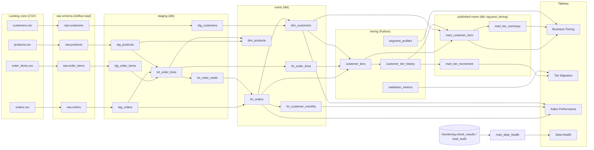

# Data Lineage & Metadata

## End-to-end lineage

## Where lineage and metadata live

| Artifact | What it captures | How to view |
|---|---|---|
| dbt docs (`dbt docs generate`) | Model/source/test DAG, column descriptions, Tableau exposures | `make docs` -> http://localhost:8080 |
| dbt `persist_docs` | Model and column descriptions written as Postgres/Snowflake comments | Any SQL client / Tableau field descriptions |
| `monitoring.load_audit` | Per-batch source file, checksum, rows, watermarks, duration | SQL / Data Health dashboard |
| `monitoring.check_results` | Every freshness, volume, drift and GX result with run_id | SQL / Data Health dashboard |
| `_batch_id`, `_loaded_at`, `_source_file` | Row-level provenance on every raw table | SQL |
| `tiering.*` `run_id` / `as_of_date` | Which run and as-of date produced each tier | SQL |
| `snapshots.customers_snapshot` | SCD2 history of customer attributes | SQL |
| Airflow Datasets + OpenLineage provider | Task-level lineage (enable in `docker-compose.yml`) | Airflow Datasets view / Marquez |
| `config/schema_contracts.yml` | Data contracts for each source | Repo |

## Ownership

| Layer | Owner | SLA |
|---|---|---|
| raw | Data Engineering | loaded by 06:30 daily; freshness warn 26h / error 50h |
| staging, marts | Analytics Engineering | built by 07:00 daily |
| tiering | Analytics / Data Science | scored daily; validated on each run |
| Tableau extracts | BI | refreshed after `publish_tableau` |
